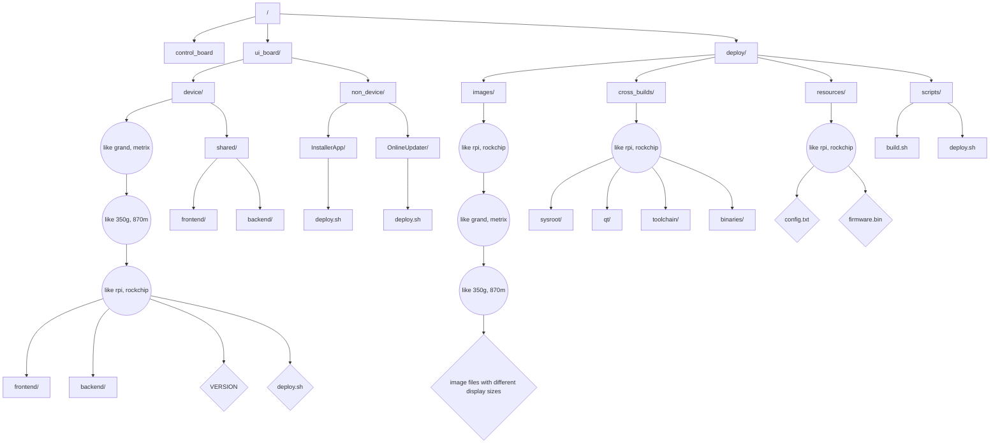

# Novin Device Structure (Draft)



> Note: All device frontend/backend use shared code

---

Option 1: Board-Centric Structure

```
device_x/
  ui_board/
    frontend/
    backend/
    bridge/
    VERSION
    deploy.sh
  control_board/
    firmware/
    drivers/
    VERSION
    deploy.sh
  shared/
    protocol/
    utils/
```

Option 2: Function-Centric Structure

```
device_x/
  frontend/         # UI code for UI board
  backend/          # Backend/bridge code for UI board
  control_firmware/ # Low-level control board code
  shared/           # Shared code (protocols, utils)
  deploy/
    ui_board.sh
    control_board.sh
```

Option 3: Board-Type Separation at Higher Level

```
code/
  ui_boards/
    device_x/
      frontend/
      backend/
      bridge/
  control_boards/
    device_x/
      firmware/
      drivers/
  shared/
    protocol/
    utils/
```

Option 4: Versioned Device Structure (as in your draft, but with board split)

```
code/
  device_x/
    ui_board/
      frontend/
      backend/
      bridge/
    control_board/
      firmware/
      drivers/
    shared/
      protocol/
      utils/
```

Key Points:

- Separate UI/bridge and control board code for clarity and team ownership.
- Use a shared directory for protocol definitions and utilities used by both boards.
- Keep deployment scripts and versioning per board if their release cycles differ.
- Consider mirroring this structure for each device type/version.

Let me know if you want a specific option detailed or adapted to your naming conventions!

Here are some naming options for the two board types in your directory structure:

For UI Boards:

- ui_board
- bridge_board
- main_board
- application_board
- interface_board
- host_board
- master_board

For Control Boards:

- control_board
- logic_board
- mcu_board
- slave_board
- hardware_board
- peripheral_board
- device_board

You can mix and match based on your team's preference and the terminology used in your documentation or hardware. For example: ui_board & control_board, main_board & logic_board, or bridge_board & mcu_board.
