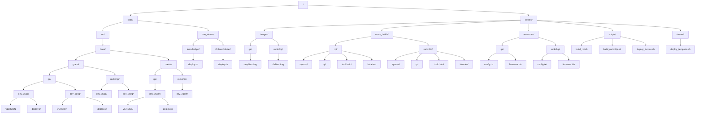

# Novin Device Structure (Draft)

```mermaid
flowchart TD
root["/"]
code["code/"]
deploy["deploy/"]

root --> code
root --> deploy

code --> src["src/"]
src --> base["base/"]
base --> grand["grand/"]
base --> metrix["metrix/"]
grand --> grand_rpi["rpi/"]
grand --> grand_rockchip["rockchip/"]
metrix --> metrix_rpi["rpi/"]
metrix --> metrix_rockchip["rockchip/"]
grand_rpi --> dev_350g["dev_350g/"]
grand_rpi --> dev_360g["dev_360g/"]
grand_rockchip --> dev_350g_rk["dev_350g/"]
grand_rockchip --> dev_360g_rk["dev_360g/"]
metrix_rpi --> dev_215m["dev_215m/"]
metrix_rockchip --> dev_215m_rk["dev_215m/"]

code --> non_device["non_device/"]
non_device --> installer["InstallerApp/"]
non_device --> updater["OnlineUpdater/"]

deploy --> images["images/"]
deploy --> cross_builds["cross_builds/"]
deploy --> resources["resources/"]
deploy --> scripts["scripts/"]
deploy --> shared["shared/"]

images --> images_rpi["rpi/"]
images --> images_rockchip["rockchip/"]
images_rpi --> raspbian_img["raspbian.img"]
images_rockchip --> debian_img["debian.img"]

cross_builds --> cb_rpi["rpi/"]
cross_builds --> cb_rockchip["rockchip/"]
cb_rpi --> cb_rpi_sysroot["sysroot/"]
cb_rpi --> cb_rpi_qt["qt/"]
cb_rpi --> cb_rpi_toolchain["toolchain/"]
cb_rpi --> cb_rpi_binaries["binaries/"]
cb_rockchip --> cb_rockchip_sysroot["sysroot/"]
cb_rockchip --> cb_rockchip_qt["qt/"]
cb_rockchip --> cb_rockchip_toolchain["toolchain/"]
cb_rockchip --> cb_rockchip_binaries["binaries/"]
scripts --> build_rpi["build_rpi.sh"]
scripts --> build_rockchip["build_rockchip.sh"]

resources --> res_rpi["rpi/"]
resources --> res_rockchip["rockchip/"]
res_rpi --> rpi_config["config.txt"]
res_rpi --> rpi_firmware["firmware.bin"]
res_rockchip --> rockchip_config["config.txt"]
res_rockchip --> rockchip_firmware["firmware.bin"]

scripts --> deploy_device["deploy_device.sh"]
shared --> deploy_template["deploy_template.sh"]
dev_350g --> version_350g["VERSION"]
dev_350g --> deploy_350g["deploy.sh"]
dev_360g --> version_360g["VERSION"]
dev_360g --> deploy_360g["deploy.sh"]
dev_215m --> version_215m["VERSION"]
dev_215m --> deploy_215m["deploy.sh"]
installer --> installer_deploy["deploy.sh"]
updater --> updater_deploy["deploy.sh"]
```
